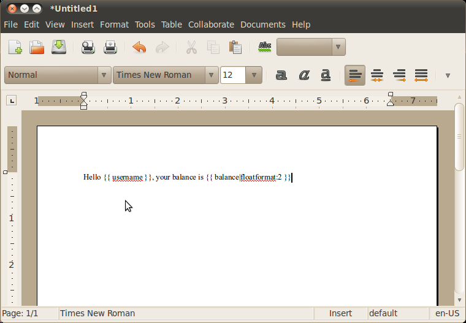
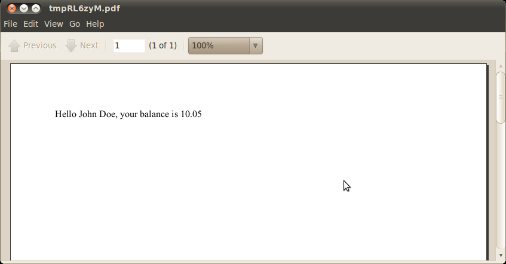

Quickstart guide
================

There are two main purposes of Webodt project

1. Generate fully functional .odt documents on a basis of odt templates.
2. With help of external backend convert ODF or HTML documents to .pdf,
   .doc, .rtf or any other format, supported by the backend.

We use a bit of "magic" which makes it possible to use Django markup right in
the word processor. As every magic, it works roughly in 85% of cases, but
sometimes works not as you would expect or does not work at all.

Examples below suppose that magic works as expected. ;-)

Instalation and configuration
-------------------------------

This is the example of basic django-webodt usage in your Django project.

Download and install django-webodt package::

    pip install django-webodt

Then add Webodt to the list of installed applications. Edit `settings.py`::

    INSTALLED_APPS = (
        ...
        'webodt',
    )

Next you have to decide which backend you want to use. Assuming that you are
under Linux, install Abiword_. Perhaps everything will work under Windows too,
but no one has checked this yet. Mark abiword as your backend of choice in
`settings.py`::

    WEBODT_CONVERTER = 'webodt.converters.abiword.AbiwordODFConverter'

Decide where you want to store your .odt templates. Webodt does not know how to
use standard Django template loaders, so please define a directory to store
your odt templates (sure enough, it's possible to use the same directory where
all other templates are stored)::

    WEBODT_TEMPLATE_PATH = '.../webodt/templates/'

Usage sample
-------------

It's about time to create your first .odt template. Just open word editor
(abiword, for example) and create something like on a screenshot below. Save
the template in ``WEBODT_TEMPLATE_PATH`` under the name `test.odt`.

Now Webodt is ready to work. Steps below demonstrate how to use Webodt to
create a pdf from this template.

Let's first create a fully fledged .odt document from the template. We replace
variables `user` and `balance` with appropriate values::

    $ ./manage.py shell

    >>> from django.template import Context
    >>> import webodt
    >>> template = webodt.ODFTemplate('test.odt')
    >>> context = dict(user='John Doe', balance=10.05)
    >>> document = template.render(Context(context))

It have to be mentioned that the document object we have created is just an
open file in a nutshell::

    >>> document
    <open file '/tmp/tmpL0AKCV.odt', mode 'rb' at 0xa7c39ec>

This is a real file stored in the file system and available to any other
application. Open `/tmp/tmpL0AKCV.odt` to make sure it's true. But there is
something special about the file too::

    >>> document.__class__
    <class 'webodt.ODFDocument'>
    >>> import os
    >>> os.path.isfile(document.name)
    True
    >>> document.close()
    >>> os.path.isfile(document.name)
    False

Being closed, document is automatically removed from the disk. It is important
that you close all your documents, otherwise you risk to produce a lot of
garbage in `/tmp` directory. You can prevent auto deletion by passing
``delete_on_close=False`` to ``render`` method of the template.

To continue our research let's make yet another document and convert it to
pdf::

    >>> document = template.render(Context(context))

Create converter and make it do the job::

    >>> from webodt.converters import converter
    >>> conv = converter()
    >>> pdf = conv.convert(document, format='pdf')
    >>> pdf
    <open file '/tmp/tmpYuAhhN.pdf', mode 'r' at 0xa7c3dfc>

Because of the ``WEBODT_CONVERTER`` settings option the converter being created
will be of the class ``webodt.converters.abiword.AbiwordODFConverter``. It is
possible to create other converters which use other backends, by the way.

Resulting file looks very similar to that one we have created with ``render``
method previously. It will be removed when closed, and, similarly this
behaviour can be disabled with an option, passed as function variable.
Additionally, resulting document can be created with another, more meaningful
name (it's defined with another option named ``output_filename``).

Having open the document, you get

To get to know more, feel free to refer full documentation.

.. _Abiword: http://www.abisource.com/

