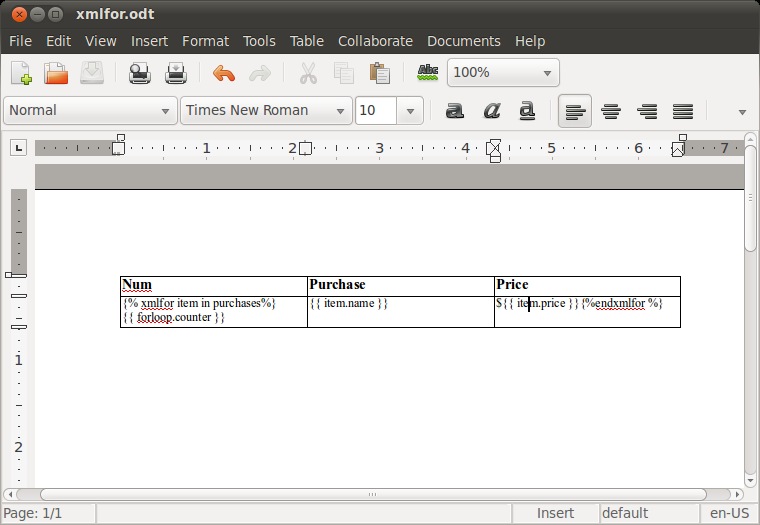
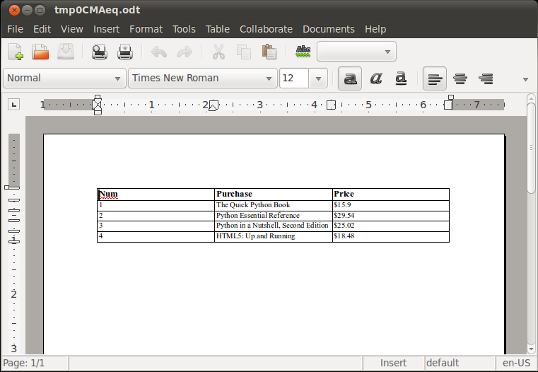

Working with tables
=====================

Suppose you want to build a document which iterates over a variable to create a
table with a number of rows. For example, you want to create the table containg
the list of purchases for a given user, like this:

==== ====================================== =======
Num  Purchase                               Price
==== ====================================== =======
1    The Quick Python Book                  $15.90
2    Python Essential Reference             $29.54
3    Python in a Nutshell, Second Edition   $25.02
4    HTML5: Up and Running                  $18.48
==== ====================================== =======

The problem is that XML code to produce such a template would look roughly like
this:

.. code-block:: xml

    <table:table table:name="Table1">
        ...
        <table:table-row>
            <table:table-cell><text:p>Num</text:p></table:table-cell>
            <table:table-cell><text:p>Purchase</text:p>
            </table:table-cell>
            <table:table-cell><text:p>Price</text:p></table:table-cell>
        </table:table-row>
        
        <table:table-row>
            <table:table-cell><text:p>{{ forloop.counter }}</text:p></table:table-cell>
            <table:table-cell><text:p>{{ item.name }}</text:p></table:table-cell>
            <table:table-cell><text:p>${{ item.price }}</text:p></table:table-cell>
        </table:table-row>
        
    </table:table>

The obvious problem is that there is no place in word processor to insert `` ... `` template tags, all you can do is to write those
tags within ``<text:p>`` XML tag.

Here the ``xmlfor`` pseudo tag comes to rescue. Instead of templating plain
XML, you can use ```` tag in the first row of the cell, and ```` in the last one. Like this:

The xmlfor is a bit of magic which django-webodt uses to simplify the work. This
magic is incapsulated in "ODF template preprocessors" which defined in
``WEBODT_ODF_TEMPLATE_PREPROCESSORS`` settings variable. The xmlfor preprocessor
gets the template source and then replaces `` ... ``
psuedo tags with ``...`` ones placing those new tags
exactly where you would expect them to find.

.. note::
    If something goes wrong you can check the contents of an attribute called `template_content`.
    It is available **only after calling a render method**.

The output will look like presented below.

